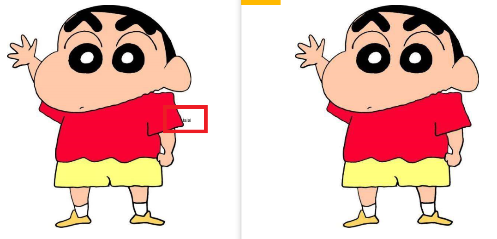
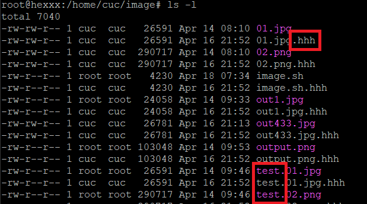

# 一、实验目的
- 熟悉shell编程
# 二、实验环境
- windows10
- Virtualbox ubuntu18.04-server-amd64
- bash： 4.4.20(1)-release
- 使用putty连接到虚拟机

# 三、实验过程
## 任务一、用bash编写一个图片批处理脚本，实现以下功能：
#### 1.支持命令行参数方式使用不同功能
#### 2.支持对jpeg格式图片进行图片质量压缩
```bash
bash image.sh -i exp04/image_process/test1.jpg -o result1.jpg -q 60 
```
#### 3.支持对jpeg/png/svg格式图片在保持原始宽高比的前提下压缩分辨率
```bash
bash image.sh -i exp04/image_process/test2.png -o result2.jpg -r 70
```

#### 4.支持对图片批量添加自定义文本水印
  ```bash
  bash image.sh -i exp04/image_process/test1.jpg -o result3.jpg -w “水印”
  ```


#### 5.支持批量重命名（统一添加文件名前缀或后缀，不影响原始文件扩展名）
```bash
bash image.sh -i input -o output -p PREFIX  #前缀
bash image.sh -i input -o output -s POSTFIX #后缀
```


#### 6.支持将png/svg图片统一转换为jpg格式图片
```bash
bash image.sh -t -i input.png -o output.jpg
```

## 任务二、编写文本批处理脚本
- 利用awk工具进行文本数据的处理
- 利用bc命令处理非整数的运算
- 关联数组的应用
#### 1.统计不同年龄范围的球员数量、百分比

年龄范围 | 人数 | 百分比
---|---|---
20岁以下 | 9 | 1.22%
20岁~30岁 | 600 | 81.52%
30岁以上 | 127| 17.25%


#### 2.统计不同场上位置的球员数量、百分比
位置 | 人数 | 百分比
---|---|---
Midfielder | 268 | 36.41%
Défenseur | 1 | 0.13%
Defender | 236 | 32.06%
Goalie | 96 | 13.04%
Forward | 135 | 18.34%

#### 3.名字最长的球员是谁？名字最短的球员是谁？
#### 4.年龄最大的球员是谁？年龄最小的球员是谁？
  条件 | 名字 | 长度/年龄 |
 --- | ---| --- |
名字最短 | Jô |  2|
名字最长|Francisco Javier Rodriguez Lazaros Christodoulopoulos Liassine Cadamuro-Bentaeba| 26
年龄最小 | Faryd Mondragon | 18岁
年龄最大 | Fabrice Olinga Luke Shaw |42岁

## 任务三、 文本批处理脚本（Web服务器访问日志）
- 数据显示过多，结果包含在在线测试中，就不在实验报告中展示。

# 四、参考文献

- [Linux bc 菜鸟教程](http://www.runoob.com/linux/linux-comm-bc.html)
- [shell 关联数组](http://c.biancheng.net/view/3009.html)
- [awk入门教程 阮一峰](http://www.ruanyifeng.com/blog/2018/11/awk.html)
- [shell脚本sed详解](https://blog.csdn.net/engledb/article/details/19623087)