# SHELL 脚本编程练习进阶
## 实验环境
- 工作主机(ubuntu-server-18.04)
    - hostonly:```192.168.56.101```
- 目标主机(ubuntu-server-18.04)
    - hostonly:```192.168.56.102```
## 实验步骤
### 工作主机免密SSH登录目标主机
- #### 生成并导入SSH-KEY至目标主机
    - 在工作主机生成ssh-key
        ```bash
        # foo为Key的名称
        ssh-keygen -f foo
        ```
    - 修改目标主机```/etc/ssh/sshd_config```配置
        ```bash
        # 设置可通过口令认证SSH
        PasswordAuthentication yes
        # 可以root用户登录
        PermitRootLogin yes
        ```
    - 重启目标主机的SSH服务
        ```bash
        sudo systemctl restart ssh
        ```
    - 工作主机通过```ssh-copy-id```方式导入ssh-key
        ```bash
        ssh-copy-id -i ~/foo root@192.168.56.102
        ```
- #### 设置免密登录
    - 取消root口令并禁用口令登录
        ```bash
        sudo passwd -l root
        # 修改目标主机配置文件
        vim /etc/ssh/sshd_config
        PasswordAuthentication no
        PermitRootLogin without-password

        # 重启ssh服务
        sudo systemctl restart ssh
        ```
#### 配置文件
- [sshd_config](config/sshd_config)
#### 实验结果
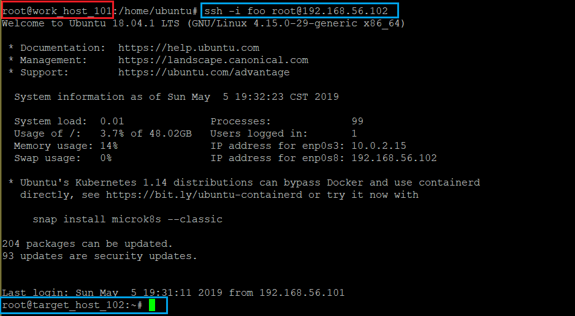
##### 参考资料
- [how to set up passwordless ssh access for root user](https://askubuntu.com/questions/115151/how-to-set-up-passwordless-ssh-access-for-root-user)


### FTP
#### 实验工具
- vsftpd
##### 选择原因:
- 轻量级ftp服务器软件，可以满足实验需求
- 有大型站点信任并使用vsftpd,侧面证明安全性
- CVE漏洞数量位于```ProFTPd```和```PureFTPd```之间
- 网上参考资料多
##### 参考资料
- [proftpd vs pureftpd vs vsftpd](https://systembash.com/evaluating-ftp-servers-proftpd-vs-pureftpd-vs-vsftpd/)
- [vsftpd](https://security.appspot.com/vsftpd.html)
#### 实验过程
[vsftpd.sh](script/vsftpd.sh)
[vsftpd.conf](config/vsftpd.conf)
- 通过工作主机运行脚本在目标主机安装vsftpd并完成相关配置
    - 将```vsftpd.sh```拷贝到目标主机
    
    - 在工作主机运行```vsftpd.sh```脚本
    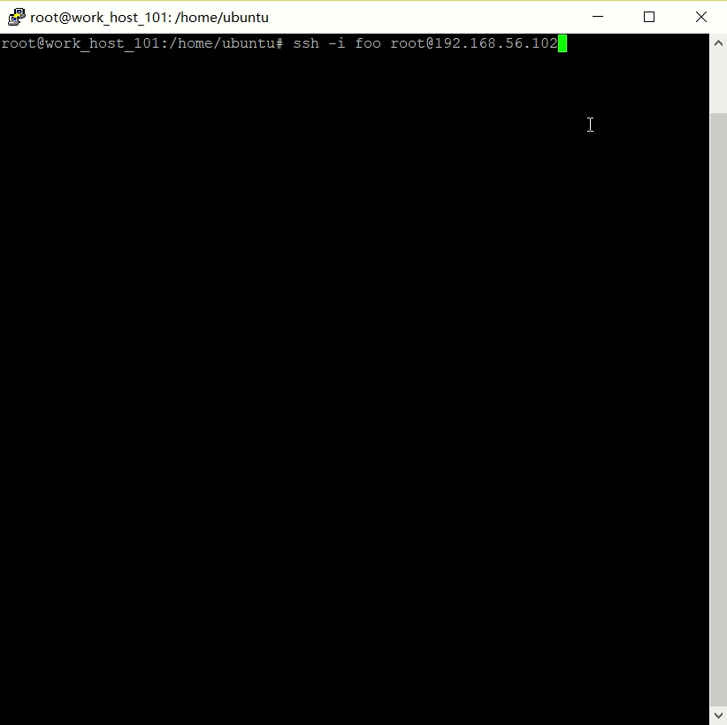
- 配置一个提供匿名访问的FTP服务器，匿名访问者可以访问1个目录且仅拥有该目录及其所有子目录的只读访问权限;
    - 匿名用户拥有且只拥有一个目录
    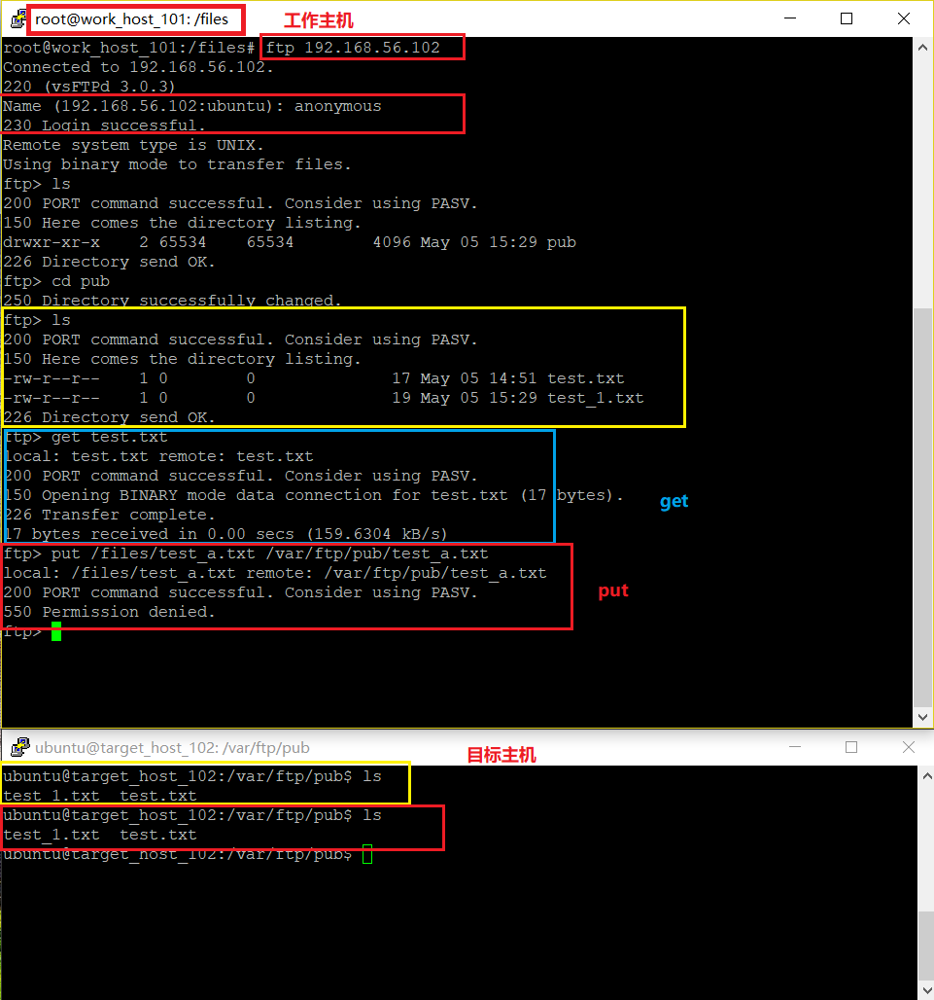
    - 匿名用户对该目录只有只读权限
    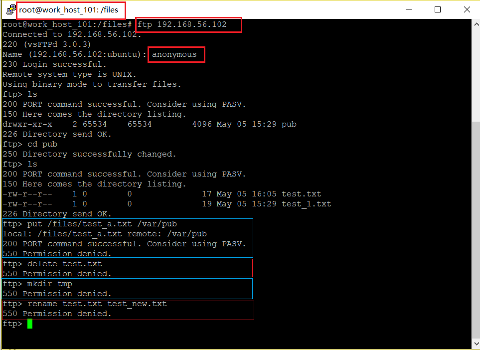
- 配置一个支持用户名和密码方式访问的账号，该账号继承匿名访问者所有权限，且拥有对另1个独立目录及其子目录完整读写（包括创建目录、修改文件、删除文件等）权限;
    - 访问,增加文件
    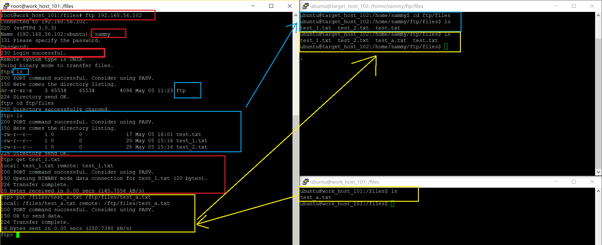
    - 删除文件,创建目录
    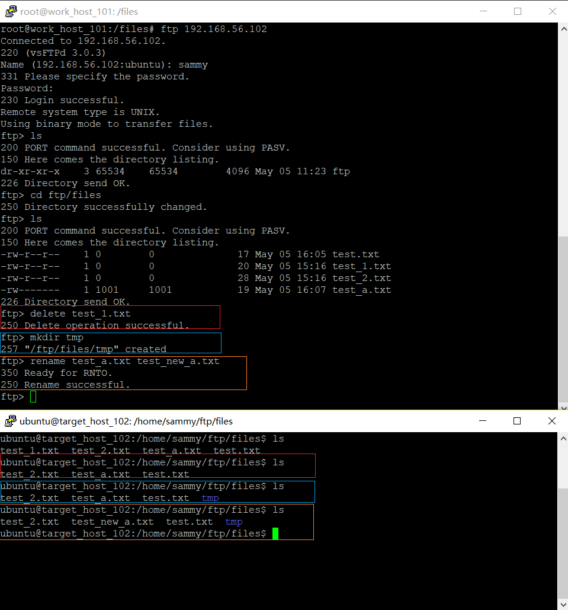
-  FTP用户不能越权访问指定目录之外的任意其他目录和文件;
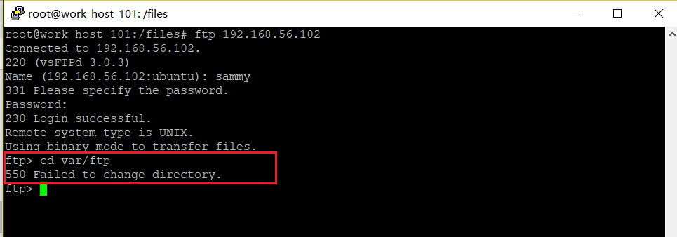
- 匿名访问权限仅限白名单IP来源用户访问，禁止白名单IP以外的访问


##### 参考资料
- [wiki-ftp](https://zh.wikipedia.org/zh-cn/%E6%96%87%E4%BB%B6%E4%BC%A0%E8%BE%93%E5%8D%8F%E8%AE%AE)
- [how to set up vsftpd for a user's directory on ubuntu18.04](https://www.digitalocean.com/community/tutorials/how-to-set-up-vsftpd-for-a-user-s-directory-on-ubuntu-18-04)
- [how to set up vsftpd for anonymous on ubuntu 16.04](https://www.digitalocean.com/community/tutorials/how-to-set-up-vsftpd-for-anonymous-downloads-on-ubuntu-16-04)
- [regex-match-everything-after-question-mark](https://stackoverflow.com/questions/4419000/regex-match-everything-after-question-mark)
- [vsftpd-limit-connection-to-a-set-of-ip-addresses](https://serverfault.com/questions/577393/vsftpd-limit-connection-to-a-set-of-ip-addresses)
- [using-sed-to-copy-lines-and-delete-characters-from-the-duplicates](https://stackoverflow.com/questions/7369047/using-sed-to-copy-lines-and-delete-characters-from-the-duplicates)
- [how-to-comment-a-line-based-on-the-word-it-starts-with](https://unix.stackexchange.com/questions/336767/how-to-comment-a-line-based-on-the-word-it-starts-with)
- [ftp/video/Linux/2018/2018-04-24-2010-22-51.mp4](http://sec.cuc.edu.cn/ftp/video/Linux/2018/2018-04-24%2010-22-51.mp4)


### NFS
#### 实验文件
- [nfs_c.sh](script/nfs_c.sh)
- [nfs_s.sh](script/nfs_s.sh)
- [exports](config/exports)
#### 实验过程
- 在通过工作主机运行脚本在目标主机安装vsftpd并完成相关配置
    - 将```nfs_s.sh```拷贝到目标主机，工作主机运行```nfs_s.sh```脚本
    
    - 在工作主机运行```nfs_c.sh```脚本
- 在1台Linux上配置NFS服务，另1台电脑上配置NFS客户端挂载2个权限不同的共享目录，分别对应只读访问和读写访问权限;
    - 创建的两个目录分别为:只读--```/nfs/gen_r```和读写--```/nfs/gen_rw```
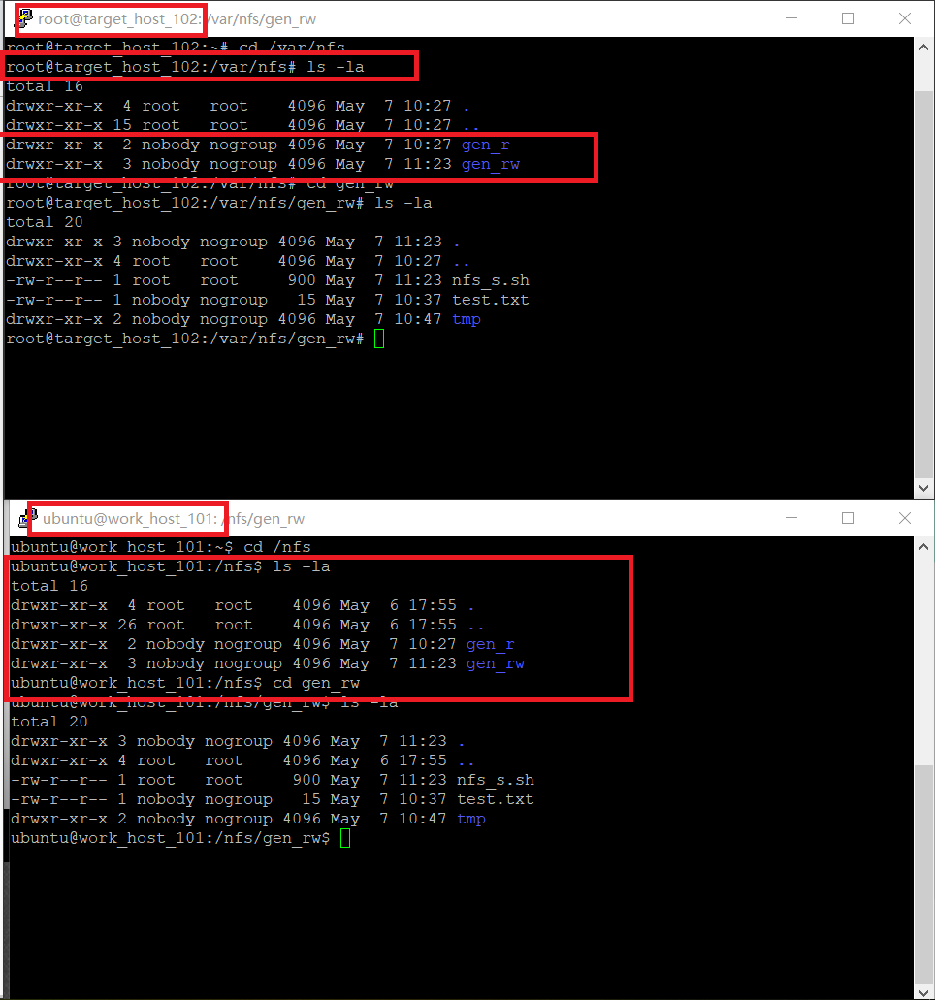
    - 两个共享文件目录对应只读和读写访问权限
    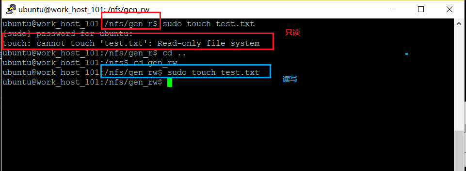
- 共享目录中文件、子目录的属主、权限信息
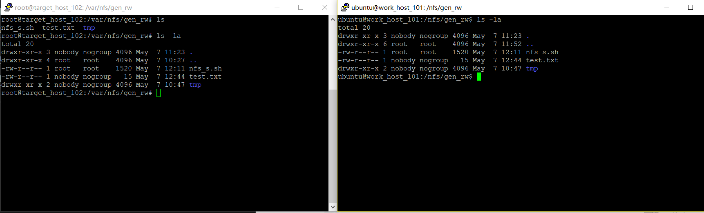
- 根据[资料](https://www.digitalocean.com/community/tutorials/how-to-set-up-an-nfs-mount-on-ubuntu-18-04)
    > By default, NFS translates requests from a root user remotely into a non-privileged user on the server. This was intended as security feature to prevent a root account on the client from using the file system of the host as root. no_root_squash disables this behavior for certain shares.
    - 添加两个/home下的共享目录，分别设置```no_root_squash```和不设置```no_root_squash```
        - 对于设置了```no_root_squash```的共享目录
        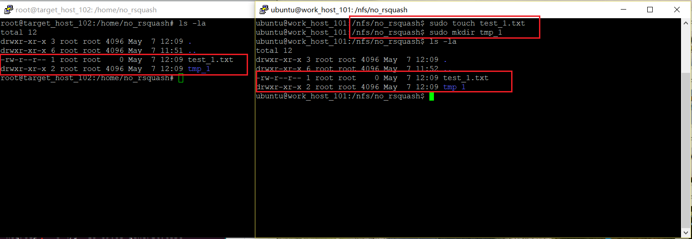   
        - 没有设置过```no_root_squash```的共享目录，无法在工作机器(client)写入文件，创建目录
        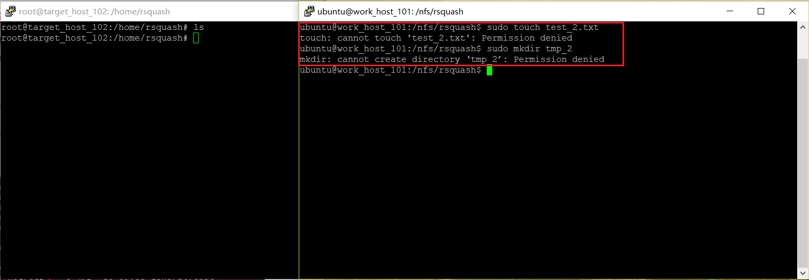

##### 参考资料
- [how to set up an nfs mount on ubuntu 18.04](https://www.digitalocean.com/community/tutorials/how-to-set-up-an-nfs-mount-on-ubuntu-18-04)   


### DHCP
#### 实验文件
- [dhcp.sh](script/dhcp.sh)
- [dhcpd.conf](config/dhcpd.conf)
- [isc-dhcp-server](config/isc-dhcp-server)

#### 实验过程
- client [intnet网卡]
    ```bash
    network:
    version: 2
    renderer: networkd
    ethernets:
        enp0s3:
            dhcp4: yes
        enp0s8:
            dhcp4: yes
        enp0s9:
            dhcp4: yes
    ```
- server [intnet网卡]
    ```bash
    network:
    version: 2
    renderer: networkd
    ethernets:
        enp0s3:
            dhcp4: yes
        enp0s8:
            dhcp4: yes
        enp0s9:
            # 必须静态配置
            dhcp4: no
            addresses: [192.168.57.1/24]
    ```
##### Server
运行脚本
##### Client
- 在```/etc/01-netcfg.yaml```文件中添加```enp0s9```,设置```dhcp4: yes```
- ```sudo netplan apply```使配置生效
##### 实验结果
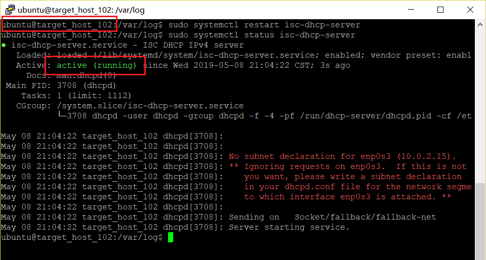
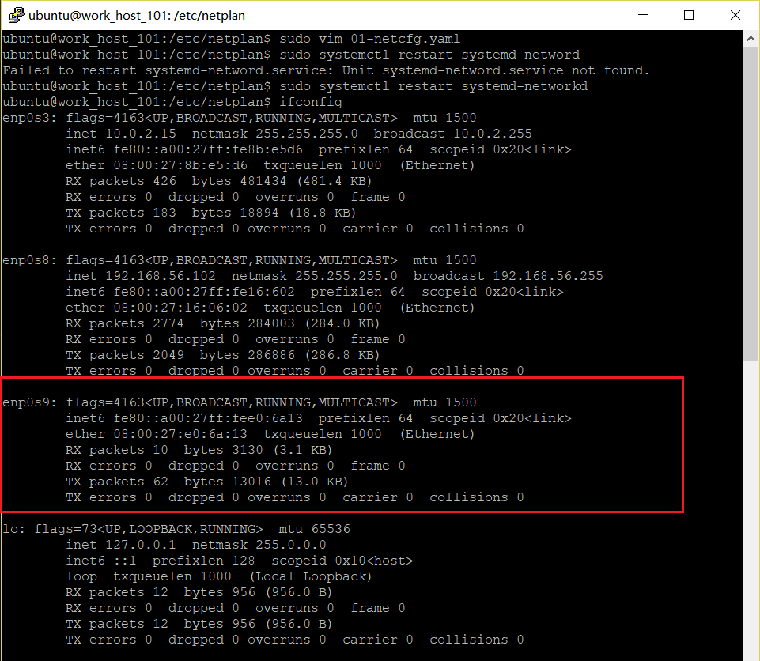
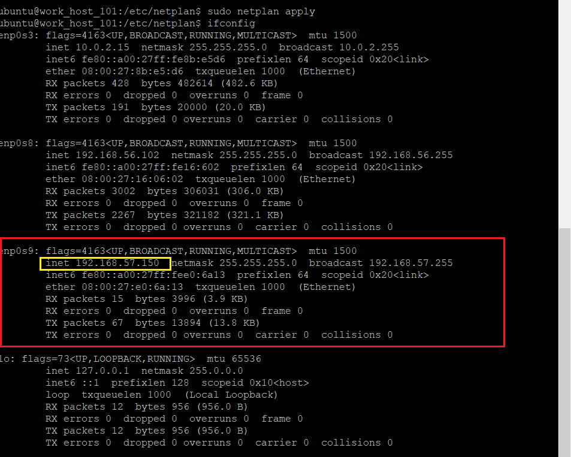
##### 参考资料
- [configure-static-ip-addresses-on-ubuntu-18-04](https://websiteforstudents.com/configure-static-ip-addresses-on-ubuntu-18-04-beta/)
- [isc-dhcp-server](https://help.ubuntu.com/community/isc-dhcp-server)

### DNS[手动配置]
#### 实验文件
- [client-head](config/head)
- [server-named.conf.options](config/named.conf.options)
- [server-named.conf.local](config/named.conf.local)
- [server-db.cuc.edu.cn](config/db.cuc.edu.cn)

#### 实验过程
##### server
- 安装```Bind```
    ```bash
    sudo apt-get install bind9
    ```
- 修改配置文件```options```
    ```bash
    sudo vim /etc/bind/named.conf.options
    # 添加如下配置
    listen-on { 192.168.57.1; };
    allow-transfer { none; };
    forwarders {
        8.8.8.8;
        8.8.4.4;
    };
    ```
- 编辑配置文件```named.conf.local```
    ```bash
    sudo vim /etc/bind/named.conf.local

    # 添加如下配置
    zone "cuc.edu.cn" {
        type master;
        file "/etc/bind/db.cuc.edu.cn";
    };
    ```
- 生成配置文件```db.cuc.edu.cn```
    ```bash
    sudo cp /etc/bind/db.local /etc/bind/db.cuc.edu.cn
    ```
- 编辑配置文件```db.cuc.edu.cn```
    ```bash
    ;
    ; BIND data file for local loopback interface
    ;
    $TTL    604800
    ;@      IN      SOA     localhost. root.localhost.(

    @       IN      SOA     cuc.edu.cn. admin.cuc.edu.cn. (
                                2         ; Serial
                            604800         ; Refresh
                            86400         ; Retry
                            2419200         ; Expire
                            604800 )       ; Negative Cache TTL
    ;
    ;@      IN      NS      localhost.
            IN      NS      ns.cuc.edu.cn.
    ns      IN      A       192.168.57.1
    wp.sec.cuc.edu.cn.      IN      A       192.168.57.1
    dvwa.sec.cuc.edu.cn.    IN      CNAME   wp.sec.cuc.edu.cn.
    @       IN      AAAA    ::1

    ```
##### client
- 安装```resolvconf```
    ```bash
    sudo apt-get update && sudo apt-get install resolvconf
    ```
- 修改配置文件
    ```bash
    sudo vim /etc/resolvconf/resolv.conf.d/head
    # 增加配置
    search cuc.edu.cn
    nameserver 192.168.57.1

    ```


#### 实验结果
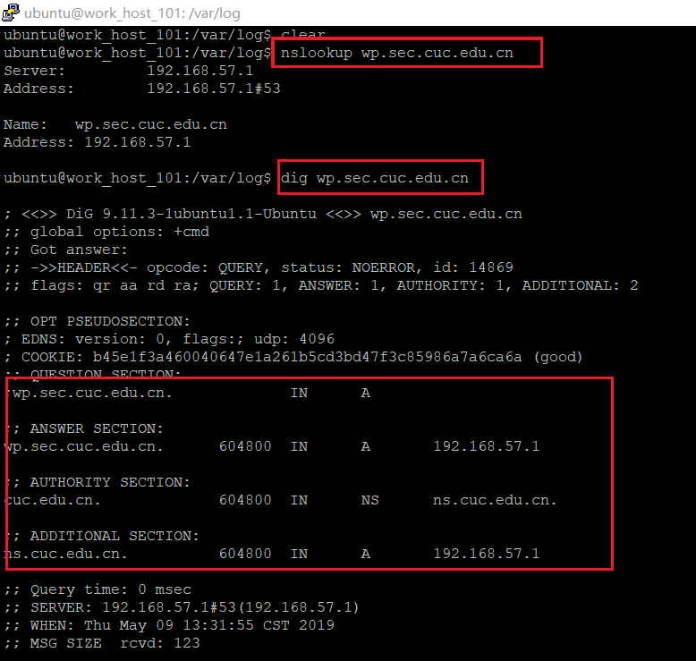
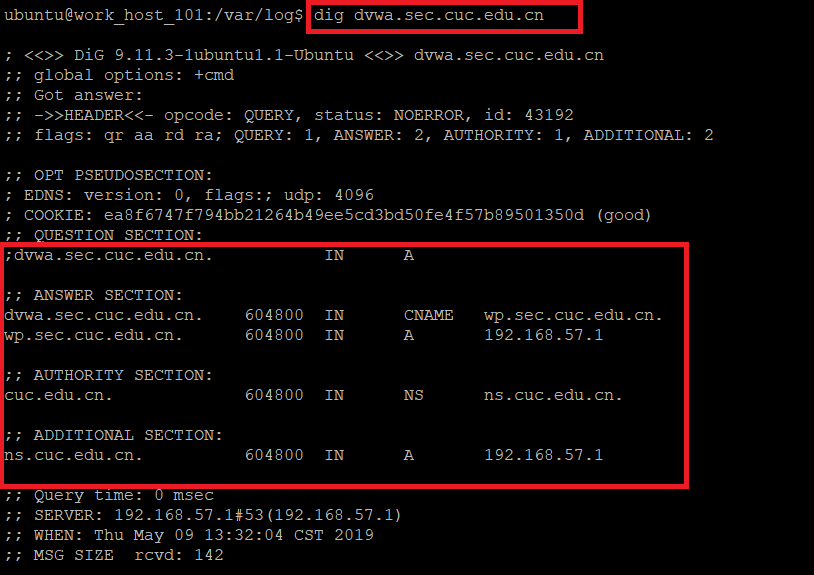
##### 参考资料
- [dns-install](https://help.ubuntu.com/lts/serverguide/dns-installation.html.en)
- [JuliBeacon](https://github.com/CUCCS/2015-linux-public-JuliBeacon/blob/614c2b31ca9306043bdd7fedd0d318cc9ed44e95/%E5%AE%9E%E9%AA%8C%206/%E5%AE%9E%E9%AA%8C6.md)


### 


