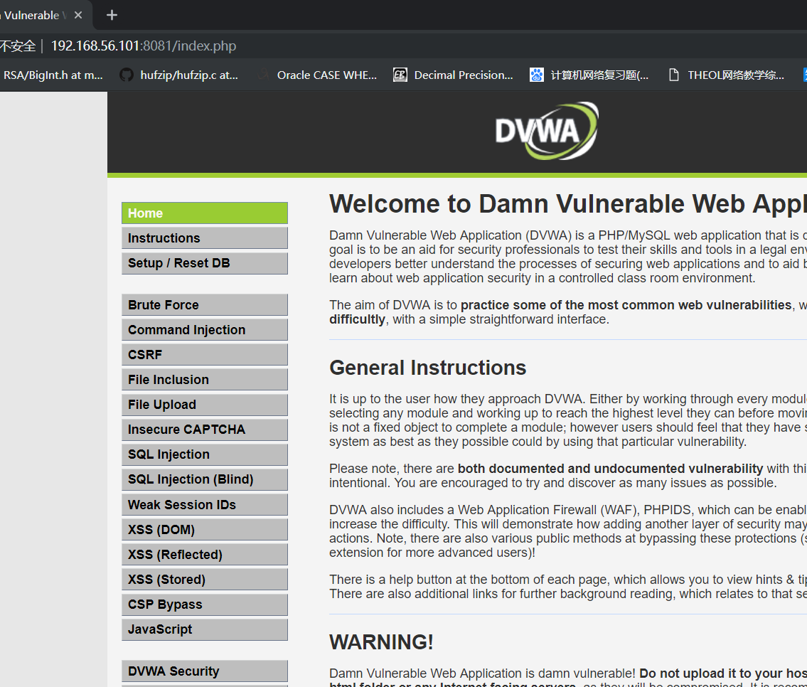
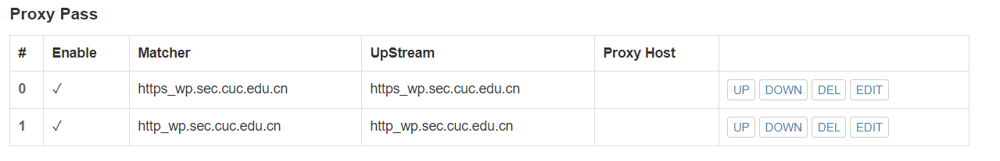

## WEB服务器(实验)

### 实验环境
- ubuntu 18.04 server
- windows10
- nginx
- verynginx
### 实验环境搭建
#### 安装```VeryNginx```
- 安装```git```
    ```bash
    sudo apt-get update
    sudo apt install git

    git config --global user.name "Your Name"
    git config --global user.email "youremail@domain.com"
    ```
- 将```VeryNgnx```仓库克隆到本地
    ```bash
    git clone https://github.com/alexazhou/VeryNginx.git
- 进入本地```VeryNginx```仓库，执行```install.py```
    ```bash
    sudo python install.py install
    ```
    - 根据报错添加依赖
    ```bash
    sudo apt-get update
    sudo apt install libssl libssl1.0-dev
    apt install libpcre3 libpcre3-dev
    sudo apt install zlib1g-dev
    ```
- 修改[/opt/verynginx/openresty/nginx/conf/nginx.conf](nginx.conf)文件配置,将server模块监听端口改为8087
- 修改主机hosts文件,添加```192.168.56.101 vn.sec.cuc.edu.cn```
- 相关命令
    ```bash
    #启动服务
    /opt/verynginx/openresty/nginx/sbin/nginx

    #停止服务
    /opt/verynginx/openresty/nginx/sbin/nginx -s stop

    #重启服务
    /opt/verynginx/openresty/nginx/sbin/nginx -s reload
    ```
- 运行结果
    
    - 输入```verynginx/verynginx```登录
        
    
#### 安装```Nginx```
```bash
sudo apt update
sudo apt install nginx
```
#### 基于```LEMP```安装```WordPress```
##### 参考链接
- [How to install wordpress with LEMP on ubuntu 18.04](https://www.digitalocean.com/community/tutorials/how-to-install-wordpress-with-lemp-on-ubuntu-18-04)
- [How to install linux nginx mysql php LEMP stack ubuntu 18.04](https://www.digitalocean.com/community/tutorials/how-to-install-linux-nginx-mysql-php-lemp-stack-ubuntu-18-04)

##### Mysql
- 创建```WordPress```独立数据库
    ```sql
    CREATE DATABASE wordpress DEFAULT CHARACTER SET utf8 COLLATE utf8_unicode_ci;
    ```
- 创建账户，设置密码
    ```sql
    GRANT ALL ON wordpress.* TO 'wordpressuser'@'localhost' IDENTIFIED BY 'password';
    ```
- 刷新更改
    ```bash
    FLUSH PRIVILEGES;
    ```
##### PHP
- 安装相关拓展
    ```bash
    sudo apt update
    sudo apt install php-curl php-gd php-intl php-mbstring php-soap php-xml php-xmlrpc php-zip
    ```
- 重启```php7.2-fpm```
    ```bash
    sudo systemctl restart php7.2-fpm
    ```

##### WordPress下载
```bash
cd /tmp
# 将安装包下载至临时目录
curl -LO https://wordpress.org/wordpress-4.7.tar.gz
# 解压
tar xzvf wordpress-4.7.tar.gz

# 复制配置文件到wordpress实际读取的文件中
 cp /tmp/wordpress/wp-config-sample.php /tmp/wordpress/wp-config.php

 # 创建wordpress根目录
 mkdir /var/www/html/wq.sec.cuc.edu.cn

 # 将tmp目录下文件复制到根目录
 sudo cp -a /tmp/wordpress/. /var/www/html/wq.sec.cuc.edu.cn

 # 分配文件所有权至nginx运行的用户和组
 sudo chown -R www-data:www-data /var/www/wordpress
 ```
##### Nginx配置
- 实现使用Ip地址访问wordpress
    - 修改```wp-config.php```,更新数据库相关信息
    - 为```wordpress```创建配置文件[/etc/nginx/sites-available/wp.sec.cuc.edu.cn](wp.sec.cuc.edu.cn)
        ```bash
        server {
            listen 8080;
            listen [::]:8080 ipv6only=on;

            root /var/www/html/wp.sec.cuc.edu.cn;

            index index.php index.html index.htm index.nginx-debian.html;

            server_name 192.168.56.101;

            location / {

                    try_files $url/=404;
            }

            location ~ \.php$ {
                    include snippets/fastcgi-php.conf;
                    fastcgi_pass unix:/var/run/php/php7.2-fpm.sock;
            }

            location ~ /\.ht{
                    deny all;
            }
        }
        ```
    - 创建软链接
        ```bash
        sudo ln -s /etc/nginx/sites-available/wp.sec.cuc.edu.cn /etc/nginx/sites-enabled/
        ```
    - 重启nginx
        ```bash
        sudo systemctl restart nginx
        ```
    - ```http://192.168.56.101:8080```访问
        
    - 错误
    第一次做的时候遇到
    
    查看日志
    
    查看对应配置文件，当时只是直接取消php解析的注释，但是默认的配置文件里注释中php-fpm为7.0，但是我实际安装的是7.2。


#### 安装DVWA
##### 参考链接
- [How to Install and Configure DVWA Lab on Ubuntu 18.04 server](https://kifarunix.com/how-to-setup-damn-vulnerable-web-app-lab-on-ubuntu-18-04-server/)

###### 下载DVWA
 ```bash

# 在/var/www/html下为DVWA创建目录
sudo mkdir /var/www/html/DVWA
# 将安装仓库克隆到临时目录下
git clone https://github.com/ethicalhack3r/DVWA /tmp/DVWA

# 将安装文件拷贝到/var/www/html/DVWA网站根目录下
sudo rsync -avP /tmp/DVWA/ /var/www/html/DVWA
```

##### 配置DVWA
- 数据库配置
    - 复制```config.inc.php.dist```到```config.inc.php```
        ```bash
        cp /var/www/html/DVWA/config/config.inc.php.dist /var/www/html/DVWA/config/config.inc.php
        ```
    - 在mysql中为DVWA新建用户名
        ```sql
        # 新建数据库dvwa
        CREATE DATABASE dvwa DEFAULT CHARACTER SET utf8 COLLATE utf8_unicode_ci;

        # 创建用户名dvwauser,分配管理权限并设置密码
        GRANT ALL ON dvwa.* TO 'dvwauser'@'localhost' IDENTIFIED BY 'p@ssw0rd';

        # 刷新配置
        FLUSH PRIVILEGES;

        # 退出
        exit；
        
        # 重启mysql
        sudo systemctl restart mysql
        ```

    - 修改DVWA文件配置
        ```bash
        sudo sudo vim /var/www/html/DVWA/config/config.inc.php

        $_DVWA[ 'db_server' ]   = '127.0.0.1';
        $_DVWA[ 'db_database' ] = 'dvwa';
        $_DVWA[ 'db_user' ]     = 'dvwauser';
        $_DVWA[ 'db_password' ] = 'p@ssw0rd';
        ```
- PHP配置
    - 修改```/etc/php/7.2/fpm/php.ini```
        ```bash
        vim /etc/php/7.2/fpm/php.ini

        # 修改
        allow_url_include = On
        allow_url_fopen = On
        display_errors = Off
        ```
    - 修改DVWA文件访问权限
        ```bash
        chown -R www-data.www-data /var/www/html/
        ```

- Nginx配置

    - 为DVWA创建Nginx配置文件
        ```bash
        sudo vim /etc/nginx/sites-avaliable/dvwa
        ```
    - 参照/etc/nginx/sites-avaliable/default添加服务模块

        ```bash
        server {
            listen 8081;
            listen [::]:8081 ipv6only=on;

            root /var/www/html/DVWA;

            index index.php index.html index.htm index.nginx-debian.html;

            server_name 192.168.56.101;

            location / {

                    try_files $url/=404;
            }

            location ~ \.php$ {
                    include snippets/fastcgi-php.conf;
                    fastcgi_pass unix:/var/run/php/php7.2-fpm.sock;
            }

            location ~ /\.ht{
                    deny all;
            }
        }

        ```
    - 创建软链接
        ```bash
        sudo ln -s /etc/nginx/sites-available/dvwa /etc/nginx/sites-enabled/
        ```
    - 重启nginx

##### 结果截图

点击上图下方红框,使用```admin/password```登录



### 基本要求实现
- 使用Wordpress搭建的站点对外提供访问的地址为:```https://wp.sec.cuc.edu.cn```和 ```http://wp.sec.cuc.edu.cn```
    - 修改nginx的```wordpress-http```配置
        - 设置监听端口为```127.0.0.1:8080```
        - 添加配置块，配置```wordpress-https```，设置监听端口为```127.0.0.1:4433```
    - 修改verynginx的```nginx.conf```配置文件,分别监听```443```和```80```端口
    - 配置verynginx端口转发
        - 配置```matcher```
            
        - 配置```Up Stream```
            
        - 配置```Proxy Pass```
            
    - 实验结果
        
- 使用Damn Vulnerable Web Application (DVWA)搭建的站点对外提供访问的地址为： ```http://dvwa.sec.cuc.edu.cn```
    - 修改nginx的```DVWA-http```配置
        - 设置监听端口为```127.0.0.1:8081```
    - 配置verynginx端口转发
        - 配置```matcher```
            
        - 配置```Up Stream```
            
        - 配置```Proxy Pass```
            
    - 更改windows10的```hosts```配置文件
        
    - 实验结果
        
- 服务器架构图
        
- 相关配置文件
    - [dvwa.conf](dvwa)
    - [wordpress.conf](wp.sec.cuc.edu.cn)
    - [verynginx.conf](nginx.conf)
### 安全加固要求
- 使用IP地址方式均无法访问上述任意站点，并向访客展示自定义的友好错误提示信息页面-1
    - matcher
        
    - response
        
    - filter
        
        
    - 实验结果
        
    
- Damn Vulnerable Web Application (DVWA)只允许白名单上的访客来源IP，其他来源的IP访问均向访客展示自定义的友好错误提示信息页面-2
    - matcher
        
    - response
        
    - filter
        
    - 实验结果
        
- 在不升级Wordpress版本的情况下，通过定制[VeryNginx](https://github.com/alexazhou/VeryNginx)的访问控制策略规则，热修复[WordPress < 4.7.1 - Username Enumeration](https://www.exploit-db.com/exploits/41497/)
    - 漏洞复现
        - 启动wordpress的```permalinks```
            
        - 修改```wordpress```配置文件
            
        - 漏洞利用
            
    - 定制verynginx的访问控制策略规则
        - 思路:禁止用户在非登录状态下访问```wp-json```
            
        - 实现
            - matcher
                
            - response
                
            - filter
                
        - 实验结果
            
- 通过配置[VeryNginx](https://github.com/alexazhou/VeryNginx)的Filter规则实现对[Damn Vulnerable Web Application (DVWA)](http://www.dvwa.co.uk/)的SQL注入实验在低安全等级条件下进行防护
    - 思路:匹配请求参数中出现的```union,select,order by```等可能的sql注入语句字符串
    - 实现
        - 将DVWA安全等级调整为```low```
        - matcher
            
        - response
            
        - filter
            
    - 测试:
        - 启用filter之前，输入```1' and 1=2 union select user(),database() --  ```得到数据库用户及数据库名
            
        - 启用filter之后
            
### VeryNginx配置要求
- [VeryNginx](https://github.com/alexazhou/VeryNginx)的Web管理页面仅允许白名单上的访客来源IP，其他来源的IP访问均向访客展示自定义的友好错误提示信息页面-3
    - matcher
    
    - response
    
    - filter
    
    - 实验结果
    在ubuntu18.04的```/etc/hosts```文件下添加```192.168.56.101    vn.sec.cuc.edu.cn```
    

- 通过定制[VeryNginx](https://github.com/alexazhou/VeryNginx)的访问控制策略规则实现：
    **限制站点单IP访问速率**
    - 限制DVWA站点的单IP访问速率为每秒请求数 < 50
    - 限制Wordpress站点的单IP访问速率为每秒请求数 < 20
    - 超过访问频率限制的请求直接返回自定义错误提示信息页面-4
        - frequency limit
        
        - response
        

        - 测试
        

    - 禁止curl访问
        - matcher
        
        - filter
        

        - 实验结果
        

            

### 参考资料
- [how-to-install-the-zlib-library-in-ubuntu](https://www.systutorials.com/topic/how-to-install-the-zlib-library-in-ubuntu/)
- [VeryNginx](https://github.com/alexazhou/VeryNginx/blob/master/readme_zh.md)
- [VeryNginx故障排查](https://github.com/alexazhou/VeryNginx/wiki/Trouble-Shooting)

- [nginx-nginx-emerg-bind-to-80-failed](https://stackoverflow.com/questions/14972792/nginx-nginx-emerg-bind-to-80-failed-98-address-already-in-use)

- [How To Install WordPress with LAMP on Ubuntu 18.04](https://www.digitalocean.com/community/tutorials/how-to-install-wordpress-with-lamp-on-ubuntu-18-04)
- [Install LEMP for ubuntu16.04-server](https://www.digitalocean.com/community/tutorials/how-to-install-linux-nginx-mysql-php-lemp-stack-in-ubuntu-16-04)
- [nginx-fails-to-stop](https://serverfault.com/questions/565339/nginx-fails-to-stop-and-nginx-pid-is-missing)

- [youtube-multiple-websites-on-nginx-one-ip](https://www.youtube.com/watch?v=arqv2YVp_3E&pbjreload=10)
- [multiple-websites-on-nginx-one-ip](https://askubuntu.com/questions/766352/multiple-websites-on-nginx-one-ip)
- [dvwa_sqlinject](https://zhuanlan.zhihu.com/p/25111306)
- [ab和jmeter进行GET/POST压力测试](https://blog.csdn.net/officercat/article/details/49891809)

